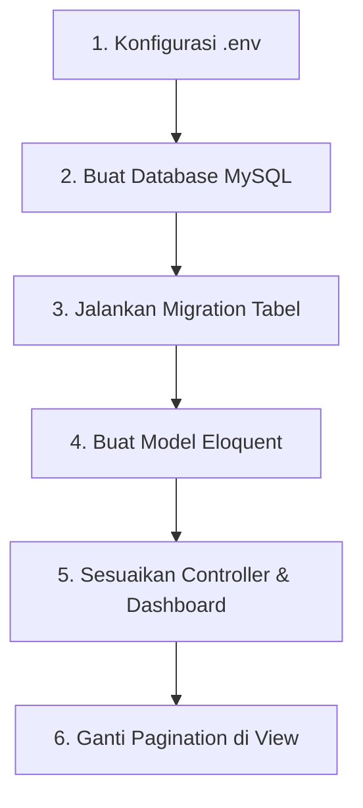

# Panduan Lengkap: Menghubungkan Aplikasi ke Database MySQL

> Dokumen ini menjelaskan langkah demi langkah untuk memigrasikan data aplikasi **Sistem Monitoring Defect** (mulai dari Dashboard, Final Assy, Pre Assy, hingga Log System) dari data statis (mock) ke database MySQL riil secara permanen.

---

## 🧭 Alur Migrasi Database


---

## 🔌 Langkah 1 — Konfigurasi File `.env`

Buka file **`.env`** yang berada di folder utama (root) project kamu, kemudian sesuaikan parameter koneksi database MySQL berikut:

```env
DB_CONNECTION=mysql
DB_HOST=127.0.0.1
DB_PORT=3306
DB_DATABASE=monitoring_defect
DB_USERNAME=root
DB_PASSWORD=
```

> [!IMPORTANT]
> Pastikan username (`DB_USERNAME`) dan password (`DB_PASSWORD`) disesuaikan dengan konfigurasi Laragon/XAMPP yang kamu gunakan di komputer kamu. Biasanya di Laragon default username adalah `root` dengan password kosong.

---

## 🗄️ Langkah 2 — Membuat Database Baru

Buka **phpMyAdmin** (`http://localhost/phpmyadmin`) atau aplikasi database client pilihanmu (HeidiSQL/DBeaver) dari Laragon, lalu buat database baru dengan menjalankan perintah SQL berikut:

```sql
CREATE DATABASE monitoring_defect CHARACTER SET utf8mb4 COLLATE utf8mb4_unicode_ci;
```

---

## 🛠️ Langkah 3 — Jalankan dan Buat Migration Tabel

### A. Migrasi Tabel `defects` (Sudah Ada di Project)
Jalankan perintah ini di terminal VS Code untuk mengeksekusi file migration tabel `defects` yang sudah tersedia:
```bash
php artisan migrate
```
Ini akan otomatis membuat tabel `defects` dengan kolom-kolom:
* `id` (bigint, primary key)
* `waktu` (datetime)
* `user_name` (varchar)
* `jenis_assy` (varchar) — berisi `'Final Assy'` atau `'Pre Assy'`
* `line_conveyor` (varchar) — brand mobil (Toyota, Nissan, Mazda)
* `konveyor` (varchar) — nama konveyor
* `jenis_defect` (varchar) — kategori defect
* `jenis_sub_defect` (varchar) — sub-defect
* `quantity` (int)

### B. Membuat Migrasi Baru untuk Tabel `activity_logs` (Log System)
Karena struktur Log System berbeda, buat migration baru dengan perintah:
```bash
php artisan make:migration create_activity_logs_table
```
Buka file migration yang baru dibuat di folder `database/migrations/xxxx_xx_xx_create_activity_logs_table.php`, lalu isi fungsi `up()` dengan script berikut:

```php
public function up()
{
    Schema::create('activity_logs', function (Blueprint $table) {
        $table->id();
        $table->dateTime('waktu');
        $table->string('user_name');
        $table->string('jenis_aksi'); // Create Report, Delete Report, Update Report, Create Account
        $table->text('aktivitas');
        $table->string('jenis_defect')->nullable();
        $table->string('ip_address');
        $table->timestamps();
    });
}
```
Setelah itu, jalankan migrasi kembali di terminal:
```bash
php artisan migrate
```

---

## 📦 Langkah 4 — Membuat Model Eloquent di Laravel

Jalankan perintah berikut di terminal untuk membuat Model:
```bash
php artisan make:model Defect
php artisan make:model ActivityLog
```

### A. Model Defect (`app/Models/Defect.php`)
Buka file `app/Models/Defect.php` dan sesuaikan kodenya menjadi:
```php
<?php

namespace App\Models;

use Illuminate\Database\Eloquent\Model;

class Defect extends Model
{
    protected $fillable = [
        'waktu',
        'user_name',
        'jenis_assy',
        'line_conveyor',
        'konveyor',
        'jenis_defect',
        'jenis_sub_defect',
        'quantity',
    ];

    protected $casts = [
        'waktu' => 'datetime',
    ];
}
```

### B. Model ActivityLog (`app/Models/ActivityLog.php`)
Buka file `app/Models/ActivityLog.php` dan sesuaikan kodenya menjadi:
```php
<?php

namespace App\Models;

use Illuminate\Database\Eloquent\Model;

class ActivityLog extends Model
{
    protected $table = 'activity_logs';

    protected $fillable = [
        'waktu',
        'user_name',
        'jenis_aksi',
        'aktivitas',
        'jenis_defect',
        'ip_address',
    ];

    protected $casts = [
        'waktu' => 'datetime',
    ];
}
```

---

## ⚙️ Langkah 5 — Update Controller ke Database Nyata

### A. Menghubungkan Dashboard (`app/Http/Controllers/DashboardController.php`)
Buka file `DashboardController.php`. Impor model di baris atas file:
```php
use App\Models\Defect;
use App\Models\User;
use Carbon\Carbon;
```
Ubah isi method `index()` agar menghitung data riil dari database:
```php
public function index()
{
    if (!session('logged_in')) {
        return redirect('/');
    }

    // Mengambil total & data hari ini dari DB
    $totalDefect = Defect::sum('quantity');
    $defectToday = Defect::whereDate('waktu', Carbon::today())->sum('quantity');
    $activeUsers = User::count(); // Atau disesuaikan dengan logic user aktif kamu
    $totalUsers = User::count();

    // Mengambil 4 data defect terbaru secara riil
    $recentDefects = Defect::orderBy('waktu', 'desc')->take(4)->get();

    return view('dashboard', compact(
        'totalDefect',
        'defectToday',
        'activeUsers',
        'totalUsers',
        'recentDefects'
    ));
}
```

### B. Menghubungkan Laporan (`app/Http/Controllers/ReportController.php`)
Buka file `ReportController.php`, impor model di bagian paling atas:
```php
use App\Models\Defect;
use App\Models\ActivityLog;
```

#### 📌 Update Method `index()` (Final Assy)
```php
public function index(Request $request)
{
    if (!session('logged_in')) return redirect('/');

    $dateRange = $request->input('date_range');
    $selectedDefect = $request->input('defect');
    $selectedLine = $request->input('line');
    $selectedConveyor = $request->input('conveyor');

    // Query ke tabel defects di DB
    $query = Defect::where('jenis_assy', 'Final Assy');

    if ($dateRange) {
        $dates = explode(' to ', $dateRange);
        $start = $dates[0];
        $end = isset($dates[1]) ? $dates[1] : $dates[0];
        $query->whereBetween('waktu', [$start . ' 00:00:00', $end . ' 23:59:59']);
    }

    if ($selectedDefect && $selectedDefect !== 'all') {
        $query->where('jenis_defect', $selectedDefect);
    }
    if ($selectedLine && $selectedLine !== 'all') {
        $query->where('line_conveyor', $selectedLine);
    }
    if ($selectedConveyor && $selectedConveyor !== 'all') {
        $query->where('konveyor', $selectedConveyor);
    }

    // Ambil opsi filter unik dari DB
    $defectOptions = Defect::where('jenis_assy', 'Final Assy')
        ->distinct()->pluck('jenis_defect')->sort()->values()->toArray();
    $lineOptions = Defect::where('jenis_assy', 'Final Assy')
        ->distinct()->pluck('line_conveyor')->sort()->values()->toArray();

    // Menggunakan Laravel Pagination (10 baris per halaman)
    $records = $query->orderBy('waktu', 'desc')->paginate(10)->withQueryString();

    return view('final_assy', [
        'records' => $records,
        'defectOptions' => $defectOptions,
        'lineOptions' => $lineOptions,
        'dateRange' => $dateRange,
        'selectedDefect' => $selectedDefect,
        'selectedLine' => $selectedLine,
        'selectedConveyor' => $selectedConveyor,
    ]);
}
```

#### 📌 Update Method `preAssy()` (Pre Assy)
Ubah kodenya mirip seperti di atas, cukup ganti `'Final Assy'` menjadi `'Pre Assy'`:
```php
$query = Defect::where('jenis_assy', 'Pre Assy');
```

#### 📌 Update Method `logSystem()` (Log System)
```php
public function logSystem(Request $request)
{
    if (!session('logged_in')) return redirect('/');

    $dateRange = $request->input('date_range');
    $selectedAction = $request->input('action');
    $selectedDefect = $request->input('defect');

    // Query ke tabel activity_logs di DB
    $query = ActivityLog::query();

    if ($dateRange) {
        $dates = explode(' to ', $dateRange);
        $start = $dates[0];
        $end = isset($dates[1]) ? $dates[1] : $dates[0];
        $query->whereBetween('waktu', [$start . ' 00:00:00', $end . ' 23:59:59']);
    }

    if ($selectedAction && $selectedAction !== 'all') {
        $query->where('jenis_aksi', $selectedAction);
    }
    if ($selectedDefect && $selectedDefect !== 'all') {
        $query->where('jenis_defect', $selectedDefect);
    }

    $actionOptions = ActivityLog::distinct()->pluck('jenis_aksi')->sort()->values()->toArray();
    $defectOptions = ActivityLog::whereNotNull('jenis_defect')->distinct()->pluck('jenis_defect')->sort()->values()->toArray();

    $records = $query->orderBy('waktu', 'desc')->paginate(10)->withQueryString();

    return view('log_system', [
        'records' => $records,
        'actionOptions' => $actionOptions,
        'defectOptions' => $defectOptions,
        'dateRange' => $dateRange,
        'selectedAction' => $selectedAction,
        'selectedDefect' => $selectedDefect,
    ]);
}
```

---

## 📺 Langkah 6 — Update Tampilan Pagination di file Blade

Ganti seluruh bagian tombol/pagination manual di file `final_assy.blade.php`, `pre_assy.blade.php`, dan `log_system.blade.php` dengan tag bawaan Laravel berikut:

```blade
{{ $records->links() }}
```

> [!TIP]
> Supaya tampilan pagination bawaan Laravel otomatis menyesuaikan dengan styling Tailwind CSS yang sudah ada, kamu bisa mempublish view pagination bawaan Laravel ke folder project-mu dengan menjalankan perintah:
> ```bash
> php artisan vendor:publish --tag=laravel-pagination
> ```
