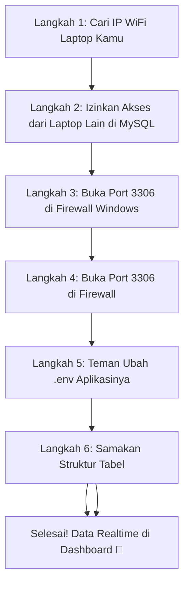

# Panduan: Menghubungkan Dua Aplikasi ke Satu Database MySQL (Realtime)

Dokumen ini menjelaskan cara menghubungkan **Aplikasi Admin (dashboard kamu)** dan **Aplikasi User (aplikasi teman kamu)** ke **satu database MySQL yang sama** agar data yang diinput user di lapangan otomatis tampil di dashboard admin secara realtime.

---

## 🎓 Pahami Konsepnya Dulu

Bayangkan database seperti **lemari arsip bersama**:

```
[Aplikasi User - Laptop/HP Teman]
         │
         │  Menyimpan laporan defect
         ▼
  ┌──────────────────────┐
  │    Database MySQL    │  ← Lemari Arsip Bersama
  │  monitoring_defect   │    (ada di laptop kamu)
  └──────────────────────┘
         │
         │  Membaca & menampilkan data
         ▼
[Aplikasi Admin - Dashboard Kamu]
```

> **Kuncinya**: Kedua aplikasi harus mengarah ke **database MySQL yang sama**.

---

## 🧭 Alur Koneksi Dua Aplikasi



---

## 🔌 Langkah 1 — Cari IP WiFi Laptop Kamu

> [!IMPORTANT]
> Langkah ini dilakukan di **laptop kamu** (yang menjalankan database MySQL Laragon). Pastikan kamu dan teman kamu terhubung ke **WiFi yang sama**.

1. Buka **Terminal** di VS Code kamu.
2. Ketik perintah berikut lalu tekan **Enter**:
   ```bash
   ipconfig
   ```
3. Cari bagian **"Wireless LAN adapter Wi-Fi"** dan lihat baris **"IPv4 Address"**:
   ```
   Wireless LAN adapter Wi-Fi:
      IPv4 Address. . . . . . : 192.168.1.5   ← Ini IP kamu (contoh)
   ```
4. **Catat angka IP tersebut** — ini yang akan kamu berikan ke teman kamu.

> [!NOTE]
> IP kamu tidak selalu `192.168.1.5`. Bisa `192.168.0.10` atau angka lain tergantung router WiFi-nya. Yang penting ambil yang ada di bagian **"Wireless LAN / Wi-Fi"**, bukan bagian Ethernet atau VirtualBox.

---

## 🗄️ Langkah 2 — Cari IP WiFi Laptop Teman Kamu

Sebelum mengizinkan akses, kita perlu tahu dulu **IP laptop teman kamu** agar hanya dia yang bisa masuk ke database — bukan semua orang di WiFi.

**Minta teman kamu** untuk membuka terminal di laptopnya dan menjalankan:
```bash
ipconfig
```
Cari bagian **"Wireless LAN adapter Wi-Fi"** → catat angka **"IPv4 Address"**-nya.
Contoh: `192.168.1.10` (ini IP teman kamu, akan dipakai di langkah berikutnya).

> [!NOTE]
> Jadi sekarang kamu punya 2 angka IP:
> * **IP laptop kamu** (dari Langkah 1) — dipakai teman kamu nanti di Langkah 4
> * **IP laptop teman kamu** (dari Langkah 2 ini) — dipakai kamu sekarang di Langkah 3

---

## 🔐 Langkah 3 — Izinkan MySQL Hanya untuk IP Teman Kamu (Aman)

Secara default, MySQL Laragon **hanya menerima koneksi dari laptop itu sendiri**. Kita buka aksesnya, tapi **khusus untuk IP teman kamu saja** — bukan semua orang.

1. Buka **HeidiSQL** dari Laragon kamu, lalu klik **Open**.
2. Klik tab **Query** (atau buka tab query baru).
3. Ketik/tempel perintah SQL ini, dan **ganti `192.168.1.10`** dengan IP teman kamu dari Langkah 2:
   ```sql
   CREATE USER IF NOT EXISTS 'root'@'192.168.1.10' IDENTIFIED BY '';
   GRANT ALL PRIVILEGES ON monitoring_defect.* TO 'root'@'192.168.1.10';
   FLUSH PRIVILEGES;
   ```
4. Tekan **F9** untuk menjalankannya.
5. Pastikan tidak ada pesan error berwarna merah di bagian bawah layar.

> [!IMPORTANT]
> Dengan cara ini, **hanya laptop teman kamu** yang bisa konek ke database kamu. Laptop lain di WiFi yang sama tidak akan bisa masuk meskipun tahu username dan password-nya.

> [!WARNING]
> Kalau IP teman kamu berubah (misalnya dia disconnect lalu connect lagi ke WiFi), IP-nya bisa berbeda. Kalau sudah tidak bisa konek, ulangi langkah ini dengan IP barunya.

---

## 🔥 Langkah 4 — Buka Port 3306 di Firewall Windows

Port 3306 adalah "pintu masuk" MySQL. Windows Firewall biasanya memblokir pintu ini dari koneksi luar. Kita perlu membukanya.

1. Tekan tombol **Windows** lalu ketik **"Windows Defender Firewall"** dan buka aplikasinya.
2. Klik **"Advanced settings"** di panel kiri.
3. Klik **"Inbound Rules"** di panel kiri.
4. Klik **"New Rule..."** di panel kanan.
5. Pilih **"Port"** → klik **Next**.
6. Pilih **"TCP"**, isi *"Specific local ports"* dengan **`3306`** → klik **Next**.
7. Pilih **"Allow the connection"** → klik **Next**.
8. Centang **Private** saja (jangan centang Public untuk keamanan lebih) → klik **Next**.
9. Beri nama: **`MySQL 3306`** → klik **Finish**.

> [!IMPORTANT]
> Langkah ini hanya perlu dilakukan **sekali saja** di laptop kamu. Dengan hanya centang **Private**, port ini hanya terbuka untuk jaringan WiFi yang sudah kamu percaya, bukan jaringan publik.

---

## ⚙️ Langkah 5 — Teman Kamu Ubah File `.env` Aplikasinya

Sekarang giliran **teman kamu** melakukan pengaturan di laptopnya sendiri.

Di laptop teman kamu, buka file `.env` aplikasi user-nya dan ubah bagian database menjadi:

```env
DB_CONNECTION=mysql
DB_HOST=192.168.1.5    ← Ganti dengan IP laptop kamu dari Langkah 1
DB_PORT=3306
DB_DATABASE=monitoring_defect
DB_USERNAME=root
DB_PASSWORD=
```

Setelah mengubah `.env`, teman kamu perlu menjalankan perintah ini di terminalnya:
```bash
php artisan config:clear
```

> [!WARNING]
> Pastikan `DB_HOST` diisi **IP laptop kamu**, bukan `127.0.0.1`. Kalau masih `127.0.0.1`, aplikasi teman kamu akan mencari database di laptopnya sendiri dan tidak akan ketemu.

---

## 🔗 Langkah 6 — Samakan Struktur Tabel

> [!IMPORTANT]
> Langkah ini **wajib dikomunikasikan dengan teman kamu**. Aplikasi user teman kamu harus menyimpan data dengan struktur kolom yang **sama persis** dengan database kamu.

Pastikan tabel `defects` di database kamu menyimpan kolom-kolom berikut:

| Kolom | Tipe Data | Keterangan |
|---|---|---|
| `id` | BIGINT | Primary key, auto increment |
| `waktu` | DATETIME | Waktu kejadian defect |
| `user_name` | VARCHAR | Nama user yang melaporkan |
| `jenis_assy` | VARCHAR | `Final Assy` atau `Pre Assy` |
| `line_conveyor` | VARCHAR | Brand mobil: Toyota / Nissan / Mazda |
| `konveyor` | VARCHAR | Nama konveyor spesifik |
| `jenis_defect` | VARCHAR | Jenis defect |
| `jenis_sub_defect` | VARCHAR | Sub jenis defect |
| `quantity` | INT | Jumlah defect |

Teman kamu harus memastikan aplikasinya mengisi **semua kolom di atas** saat menyimpan laporan baru ke database.

---

## ✅ Langkah 7 — Uji Coba Koneksi

Setelah semua langkah di atas selesai, lakukan uji coba berikut:

1. Pastikan **Laragon kamu berjalan** (klik Start All: Apache + MySQL aktif).
2. **Teman kamu** menjalankan aplikasinya dan **menginput satu laporan defect baru** dari laptopnya.
3. **Kamu** membuka halaman Final Assy atau Pre Assy di dashboard: `http://127.0.0.1:8000/final-assy`
4. **Tekan F5** untuk refresh halaman.
5. Kalau laporan yang baru diinput teman kamu **langsung muncul** di tabel → **koneksi berhasil 100%!** 🎉

---

## 🏭 Nanti Kalau Dipakai di Perusahaan?

Konsepnya sama persis, hanya lokasi databasenya yang berbeda:

| | Development (Sekarang) | Production (Nanti di Perusahaan) |
|---|---|---|
| **Database ada di** | Laptop kamu (Laragon) | Server perusahaan / Cloud |
| **User akses lewat** | Laptop teman (WiFi sama) | HP di lapangan (WiFi pabrik) |
| **Admin akses lewat** | Laptop kamu (`127.0.0.1:8000`) | Komputer admin (via IP server) |
| **Syarat koneksi** | Satu jaringan WiFi | Terhubung ke jaringan LAN pabrik |

> [!TIP]
> Untuk production di perusahaan, biasanya database dipindahkan ke **server fisik di kantor** atau **cloud server**. Semua perangkat (HP pekerja + komputer admin) cukup terhubung ke jaringan WiFi/LAN pabrik yang sama, dan semuanya akan otomatis bisa akses database tersebut.

---

## 🌐 Opsi Menggunakan API (Rekomendasi untuk Flutter/Dart)

Karena teman kamu membuat aplikasi input menggunakan **Flutter (Dart)**, cara paling aman dan standar industri adalah menggunakan **API (Application Programming Interface)**.

Dengan API, laptop teman kamu **tidak perlu konek langsung ke MySQL kamu**, melainkan mengirimkan request HTTP.

### 1. Alamat Endpoint API Kamu (Local WiFi):
- URL: `http://IP_LAPTOP_KAMU:8000/api/defects` (Ganti `IP_LAPTOP_KAMU` dengan IP laptop kamu dari Langkah 1)
- Method: `POST`
- Header: `Content-Type: application/json`

### 2. Format Data yang Harus Dikirim oleh Flutter (JSON):
```json
{
  "user_name": "Rian Hidayat",
  "jenis_assy": "Final Assy",
  "line_conveyor": "Toyota",
  "konveyor": "711W TNGA-C5",
  "jenis_defect": "MISSING PART",
  "jenis_sub_defect": "MISSING CLIP",
  "quantity": 5
}
```

### 3. Contoh Kode Flutter (HTTP Post):
Minta teman kamu untuk menggunakan package `http` di Dart untuk mengirim data:
```dart
import 'dart:convert';
import 'package:http/http.dart' as http;

Future<void> sendDefectReport() async {
  final url = Uri.parse('http://192.168.x.x:8000/api/defects'); // Ganti dengan IP laptop kamu
  
  final response = await http.post(
    url,
    headers: {'Content-Type': 'application/json'},
    body: jsonEncode({
      'user_name': 'Nama Operator',
      'jenis_assy': 'Final Assy', // Harus "Final Assy" atau "Pre Assy"
      'line_conveyor': 'Toyota',   // Brand mobil
      'konveyor': '664W-C5',        // Nama konveyor
      'jenis_defect': 'INSERT CIRCUIT',
      'jenis_sub_defect': 'CROSS CIRCUIT',
      'quantity': 1,
    }),
  );

  if (response.statusCode == 201) {
    print('Laporan berhasil dikirim!');
  } else {
    print('Gagal mengirim laporan: ${response.body}');
  }
}
```
